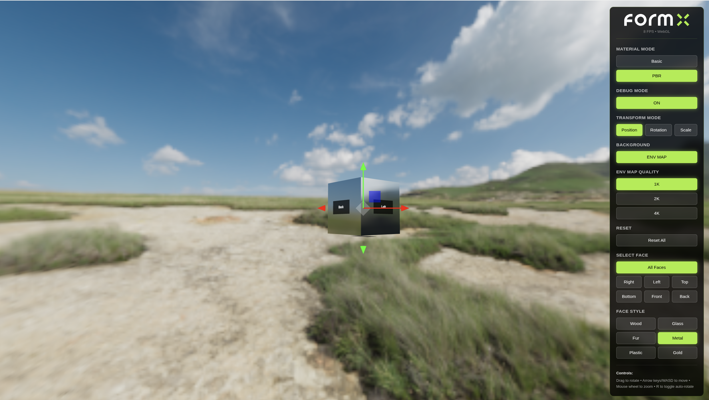

# FormX - 3D Cube Material Explorer

An interactive 3D application for exploring different materials and lighting techniques using Three.js with WebGPU/WebGL support.



## How to Run

```bash
# Install dependencies
npm install

# Start development server
npm run dev

# Build for production
npm run build

# Preview production build
npm run preview
```

The app will be available at `http://localhost:5173`

## Technical Decisions & Architecture

### Renderer-React Separation

The application maintains a strict separation between the imperative 3D renderer and the declarative React UI:

- **Imperative Renderer**: The Three.js renderer operates independently with its own lifecycle, state, and render loop
- **Declarative React**: UI components remain purely declarative, unaware of Three.js internals
- **Clear Boundary**: Communication happens through a well-defined interface (`IRenderer`)

### Centralized Coordination via `useRenderer` Hook

The `useRenderer` hook serves as the **central wiring point** between React and the renderer:

```
UI Components → useRenderer Hook → Renderer
                      ↕
                  Redux Store
```

**Key responsibilities:**
- Wraps all renderer methods with Redux dispatch calls
- Ensures Redux state and renderer state stay synchronized
- Provides a single point of coordination for all renderer interactions
- Components never access the renderer singleton directly

**Benefits:**
- Single source of truth (Redux)
- Predictable state updates
- Easy to test and debug
- All coordination logic centralized in one place

### Decoupled Renderer Architecture

The renderer is designed to be **completely decoupled** from the UI:

- **`IRenderer` Interface**: Defines the contract that any renderer must implement
- **Mock Renderer**: Fully functional console-logging renderer that proves the decoupling
- **Factory Pattern**: `getRenderer()` abstracts which implementation is used
- **No Direct Dependencies**: UI only depends on the interface, not the implementation

This architecture makes it trivial to:
- Swap renderer implementations
- Test UI without 3D rendering
- Add alternative rendering backends
- Mock for unit tests

**Testing with Mock Renderer:**

You can run the app with a mock renderer that logs all operations to the console without any 3D rendering:

```bash
# In .env, change:
VITE_USE_MOCK_RENDERER=true

# Restart the dev server
npm run dev
```

The UI works identically - all buttons, controls, and interactions function normally, but instead of rendering 3D graphics, the mock renderer logs every operation. This demonstrates the complete decoupling between the UI and the renderer implementation.

### Concurrent Non-Blocking Asset Manager

The `AssetManager` uses a sophisticated loading strategy:

- **Lazy Background Loading**: Only waits for 1k quality on init; 2k/4k load in background
- **Promise-Based Caching**: Assets are loaded once and cached for instant reuse
- **Concurrent Requests**: Multiple quality levels load in parallel
- **Zero Duplication**: Materials and environment maps are pre-instantiated and reused
- **Graceful Degradation**: Asset loading failures don't crash the app

**Performance Impact:**
- ~150ms faster initial load (only waits for 1k texture)
- Near-instant material/quality switches (cached assets)
- No redundant network requests

### Redux as Single Source of Truth

All renderer and UI state lives in Redux:

- Material type, face styles, and selections
- Debug mode, transform mode, background visibility
- Environment map quality
- Camera and cube transform defaults

**Data Flow:**
```
User Action → Redux Dispatch → useRenderer Hook → Renderer + Redux Update
```

Benefits:
- Avoids state duplication between renderer and Redux (single source of truth prevents syncing bugs)
- Time-travel debugging
- Predictable state updates
- Easy state persistence
- Clear data flow

## Features

- **WebGPU Support** with automatic WebGL fallback
- **PBR & Basic Materials** with 6 presets (Wood, Glass, Fur, Metal, Plastic, Gold)
- **HDR Environment Maps** with 1k/2k/4k quality levels
- **Per-Face Materials** in PBR mode
- **Orbit Controls** with directional mouse zoom and keyboard support (Arrow keys/WASD)
- **Auto-Rotate** mode
- **Debug Mode** with TransformControls (translate/rotate/scale) and face labels
- **Render-on-Demand** - only renders when necessary
- **Concurrent Asset Loading** - non-blocking, cached, optimized
- **FPS Counter** - real-time performance monitoring
- **Mock Renderer** - test UI without 3D rendering

## Project Structure

```
src/
├── components/          # React UI components
│   ├── Controls.tsx     # Material and scene controls
│   └── Viewport.tsx     # 3D renderer container
├── hooks/
│   └── useRenderer.ts   # Central wiring point (React ↔ Renderer)
├── renderer/            # Imperative 3D renderer
│   ├── renderer.ts      # Three.js implementation
│   ├── mockRenderer.ts  # Mock implementation (testing)
│   ├── assetManager.ts  # Asset loading and caching
│   ├── types.ts         # IRenderer interface
│   └── rendererFactory.ts
├── store/               # Redux state management
│   └── rendererSlice.ts # Renderer state and actions
└── main.tsx             # App entry point
```

## Tech Stack

- **React** - UI framework
- **TypeScript** - Type safety
- **Three.js** - 3D rendering
- **WebGPU** - Modern GPU rendering API (with WebGL fallback)
- **Redux Toolkit** - State management
- **Vite** - Build tool and dev server
- **HDRLoader** - HDR environment map loading

## Design Philosophy

1. **Separation of Concerns**: Keep imperative 3D code separate from declarative React code
2. **Single Source of Truth**: All state lives in Redux; the renderer is stateless with respect to the UI
3. **Renderer-UI Decoupling**: UI depends on abstractions (`IRenderer`), not implementations, enabling complete independence
4. **Performance First**: Render-on-demand, asset caching, concurrent loading
5. **Developer Experience**: Mock renderer, TypeScript, clear architecture
